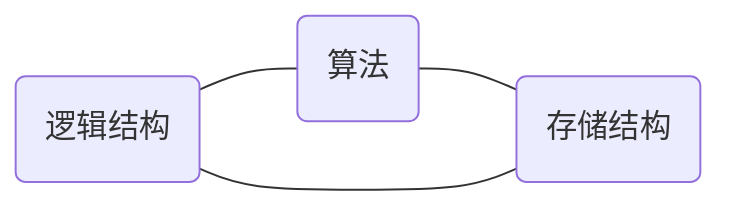

0. this line will be replaced by toc
{:toc}

#### 算法要求

- 正确性（Correctness）

  - 语法正确

  - 输入输出（IO）正确

- 可读性（Readability）

  - 使用注释（不注释比坏注释好，代码易读比过多注释好）

  - 命名契合（camelCase、PascalCase、UnderScoreCase）

- 健壮性（Robustness）

  - 完善的异常处理（处理非法输入而非处理异常）

- 高效性（Efficiency）

  - 时间复杂度 $$T(n) = O(f(n))$$
  - 空间复杂度 $$S(n) = O(f(n))$$

#### 抽象数据类型

抽象数据类型概述抽象数据类型（*Abstract* *Data* *Type*, *ADT*）是***软件构造过程中的一个重要实例***，与传统的数据类型不同的是，抽象强调作用于数据上的操作，程序员和用户无需关心数据是如何存储的，只需要设计和使用该数据类型即可。

特性：**抽象**和**封装**（class是ADT的实现）

>  `ADT = (D, S, P)`
>  数据元素的集合、数据元素的关系、数据元素集合的操作

```cpp
class Student
{
	  string studentID;
    string name;
    string gender;
    int age;
    float score;
}
```

| studentId | name  | gender | age  | score |
| :-------: | :---: | :----: | :--: | :---: |
|   0001    | Alice | female |  18  |  98   |
|   1358    |  Bob  |  male  |  20  |  47   |
|   8465    | Carol | female |  16  |  68   |
|   2358    |  Ted  |  male  |  17  |  84   |

#### 逻辑结构

数据结构的抽象表现

- 线性

  ```mermaid
  graph LR
  A-->B-->C-->D-->E
  ```

- 树形

  ```mermaid
  graph LR
  A-->B-->D
  B-->E
  B-->G
  D-->F
  A-->C
  C-->H
  ```

- 图状

  ```mermaid
  graph LR
  A-->B
  C-->B
  A-->C
  E-->C
  ```

  


#### 物理结构

逻辑结构在计算机中的实现，用存储结构来描述

- 顺序存储结构（内存空间连续）

  - 物理位置相邻

- 链式存储结构（内存空间不连续）

  - 使用Node结构

    ```c
    struct Node
    {
        some_type value;
        Node *next;
    }
    ```

$$
存储密度=\frac{数据本身存储量}{结构存储总量}
$$


#### 结构的选择

线性结构如 `array(数组)` 等不应进行很多插入删除操作，但支持随机访问，有着较快的访问速度和较小的空间需求  
链式结构如 `list(链表)` 插入删除快，但需要更多存储空间

一般来说，**作为数据集合**的逻辑结构通常有如下操作

```cpp
template<typename T, unsigned N>
class A
{
    T value[N];
    typedef size_t pos;
 public:
    T get(pos); // 访问数据
    T set(T, pos); // 更新数据

    void insert(T); // 插入数据
    void remove(pos); // 删除数据
    pos search(T); // 查找数据

    void sort(bool (*)(T, T)); // 排序
}; // 以上属性(attr)及方法(func)仅作示例
```

##### 结构与算法




即使逻辑结构相同，但实现方法不同（即存储结构不同）各种相关的算法也会不同。  
如：线性结构的线性表用冒泡排序作排序算法；链式结构的线性表用插入排序作排序算法。

同样的逻辑结构和存储结构也会因为目的不同采用不同的算法  
若算法 $$F_1$$ 有 $$T(n) = C_1n^2$$ 但系数 $$C_1$$ 较小，算法 $$F_2$$ 有 $$T(n) = C_2log_2n$$ 但系数 $$C_2$$ 较大。则有可能在数据量较小时选择 $$F_1$$ ，在数据量较大时选用 $$F_2$$。